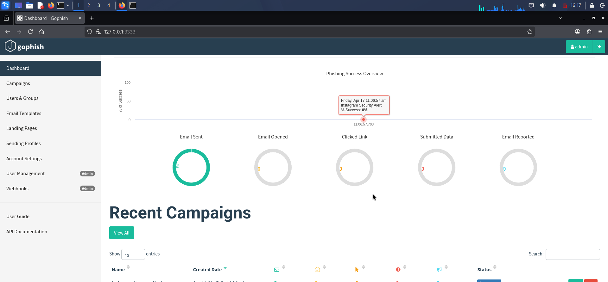
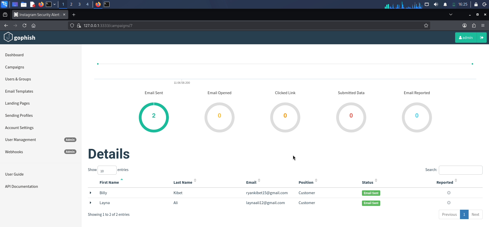
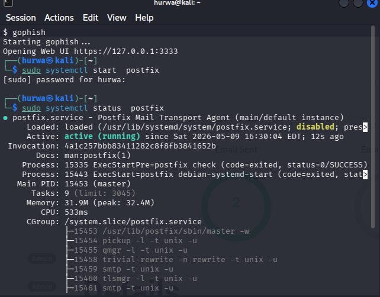
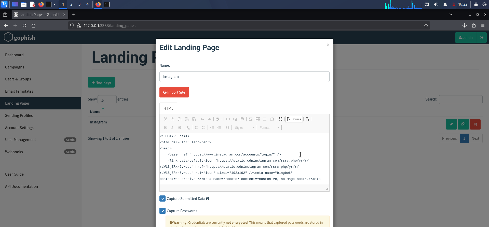

# Phishing Awareness Lab (GoPhish)

## Overview
This project demonstrates a phishing awareness simulation conducted in a controlled cybersecurity lab environment using GoPhish.

## Objective
To understand how phishing campaigns are created, deployed, and analyzed in order to improve security awareness and identify user interaction patterns.

## Tools Used
- Kali Linux
- GoPhish

## Activities Performed
- Set up GoPhish phishing framework in a lab environment
- Created phishing email templates
- Configured landing pages
- Launched simulated phishing campaign
- Monitored campaign statistics (click rates, open rates)
- Analyzed results for security awareness insights

## Key Skills Demonstrated
- Social engineering awareness
- Security testing in controlled environments
- Email phishing simulation setup
- Basic reporting and analysis
- Cybersecurity awareness training concepts

## Screenshots

## Disclaimer
This project was conducted strictly for educational purposes in an authorized lab environment. No real users or systems were targeted.
